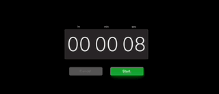

# Timer Component created in React

My goal was to replicate the MACOS clock timer, It still lacks some features like the ability to type the desired
number in each field but I hope to improve it later.
To change the fields in the box, you need to either click or use the arrows to manipulate the number inside.

## Demo



### To run locally

```bash

git clone https://github.com/RiverDave/OSXTimer.git
cd OSXTimer
npm i
```

- start local server

```bash
npm run dev
```
